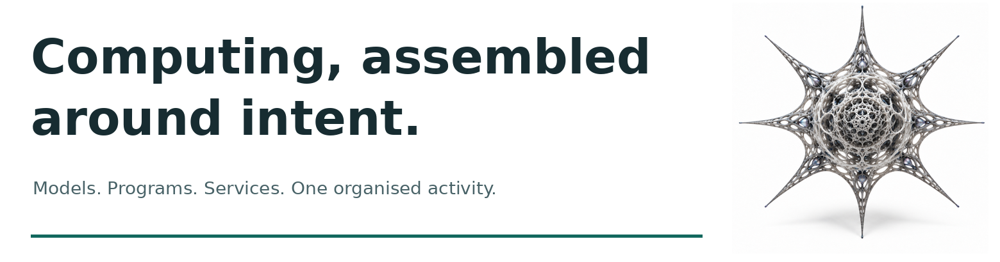
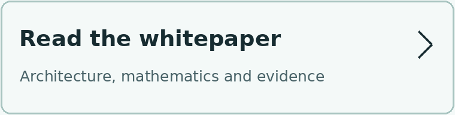
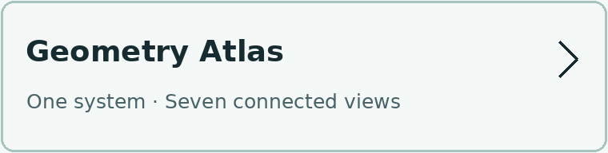
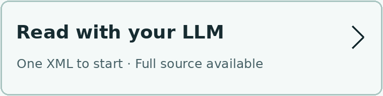
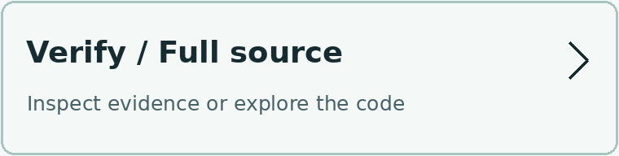
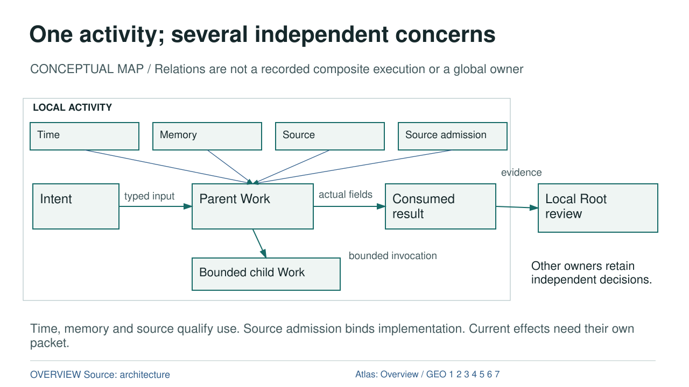

# Radiolaria OS

<p align="center">
  
</p>

**Computing, assembled around intent.**

Radiolaria OS is an execution kernel that brings models, programs, services and devices together around a practical task. It connects the work performed, the information used and the decisions of the owners involved.

**New here? Open the presentation first. No installation is needed to read the materials.**

<p align="center">
  <a href="https://github.com/AAkhtanin/hedgehog-os/releases/download/radiolaria-os-reference-g6b6f-v01/RADIOLARIA_PRESENTATION.pdf"></a>
  <a href="https://github.com/AAkhtanin/hedgehog-os/releases/download/radiolaria-os-reference-g6b6f-v01/RADIOLARIA_WHITEPAPER.pdf"></a>
</p>

<p align="center">
  <a href="https://github.com/AAkhtanin/hedgehog-os/releases/download/radiolaria-os-reference-g6b6f-v01/RADIOLARIA_ATLAS.pdf"></a>
  <a href="#read-with-an-llm"></a>
</p>

<p align="center">
  <a href="#verify"></a>
</p>

[Presentation PDF](https://github.com/AAkhtanin/hedgehog-os/releases/download/radiolaria-os-reference-g6b6f-v01/RADIOLARIA_PRESENTATION.pdf) · [Whitepaper](https://github.com/AAkhtanin/hedgehog-os/releases/download/radiolaria-os-reference-g6b6f-v01/RADIOLARIA_WHITEPAPER.pdf) · [Atlas](https://github.com/AAkhtanin/hedgehog-os/releases/download/radiolaria-os-reference-g6b6f-v01/RADIOLARIA_ATLAS.pdf) · [LLM reading](#read-with-an-llm) · [Verify](#verify)

**Published reference release:** [radiolaria-os-reference-g6b6f-v01](https://github.com/AAkhtanin/hedgehog-os/releases/tag/radiolaria-os-reference-g6b6f-v01). Code, documentation and recorded evidence are available now. Website and DOI deposit are separate follow-up work.

The detailed architecture, verification instructions, integration entry and scope follow below.



This is a **conceptual map**, not one recorded composite execution. Parent Work can
invoke bounded child Work and consume its actual result. Each local Root retains
its own final decision. Time, memory and provenance qualify use; an effect still
needs a current scoped packet and the Effect Firewall. [Full text equivalent and
relations](docs/showcase/radiolaria_os_v01/atlas/OVERVIEW.md).

## Understand

- **Main presentation:** [25-slide PDF](https://github.com/AAkhtanin/hedgehog-os/releases/download/radiolaria-os-reference-g6b6f-v01/RADIOLARIA_PRESENTATION.pdf)
  and [editable PPTX](https://github.com/AAkhtanin/hedgehog-os/releases/download/radiolaria-os-reference-g6b6f-v01/RADIOLARIA_PRESENTATION.pptx).
- **Whitepaper:** [58-page PDF](https://github.com/AAkhtanin/hedgehog-os/releases/download/radiolaria-os-reference-g6b6f-v01/RADIOLARIA_WHITEPAPER.pdf),
  [HTML source for local viewing](docs/showcase/radiolaria_os_v01/WHITEPAPER.html) and
  [Markdown](docs/showcase/radiolaria_os_v01/WHITEPAPER.md).
- **Geometry Atlas:** [8-page PDF](https://github.com/AAkhtanin/hedgehog-os/releases/download/radiolaria-os-reference-g6b6f-v01/RADIOLARIA_ATLAS.pdf)
  and [overview](docs/showcase/radiolaria_os_v01/atlas/OVERVIEW.md).
- **Technical chapters:** [intent](docs/showcase/radiolaria_os_v01/chapters/01_intent.md),
  [geometry](docs/showcase/radiolaria_os_v01/chapters/02_geometry.md),
  [time and memory](docs/showcase/radiolaria_os_v01/chapters/03_time_memory.md),
  [computation](docs/showcase/radiolaria_os_v01/chapters/04_compute.md),
  [experience](docs/showcase/radiolaria_os_v01/chapters/05_experience.md),
  [method](docs/showcase/radiolaria_os_v01/chapters/06_method.md),
  [integration](docs/showcase/radiolaria_os_v01/chapters/11_integration.md),
  [context](docs/showcase/radiolaria_os_v01/chapters/12_context.md),
  [verification](docs/showcase/radiolaria_os_v01/chapters/13_verification.md) and
  [identity](docs/showcase/radiolaria_os_v01/chapters/14_identity.md).

The [Football](docs/showcase/radiolaria_os_v01/chapters/07_football.md),
[Wedding](docs/showcase/radiolaria_os_v01/chapters/08_wedding.md) and
[Workspace](docs/showcase/radiolaria_os_v01/chapters/09_workspace.md) cases show
different participants and evidence. The [cross-case comparison](docs/showcase/radiolaria_os_v01/chapters/10_cross_case.md)
separates what they share from what each experiment actually established. A recorded
model answer, a native Work return, an effect receipt and a replay are different facts.

## Downloads

The [published reference release](https://github.com/AAkhtanin/hedgehog-os/releases/tag/radiolaria-os-reference-g6b6f-v01) provides these eight files.
Each link below downloads the named file directly; sizes are exact published bytes.

| File | Bytes | Purpose and scope |
| --- | ---: | --- |
| [RADIOLARIA_PRESENTATION.pdf](https://github.com/AAkhtanin/hedgehog-os/releases/download/radiolaria-os-reference-g6b6f-v01/RADIOLARIA_PRESENTATION.pdf) | 616,975 | 25-slide presentation; start here |
| [RADIOLARIA_PRESENTATION.pptx](https://github.com/AAkhtanin/hedgehog-os/releases/download/radiolaria-os-reference-g6b6f-v01/RADIOLARIA_PRESENTATION.pptx) | 1,728,230 | Editable presentation, same accepted 25 slides |
| [RADIOLARIA_WHITEPAPER.pdf](https://github.com/AAkhtanin/hedgehog-os/releases/download/radiolaria-os-reference-g6b6f-v01/RADIOLARIA_WHITEPAPER.pdf) | 302,367 | 58-page whitepaper: architecture, mathematics and evidence |
| [RADIOLARIA_ATLAS.pdf](https://github.com/AAkhtanin/hedgehog-os/releases/download/radiolaria-os-reference-g6b6f-v01/RADIOLARIA_ATLAS.pdf) | 36,663 | 8-page Geometry Atlas: overview and seven connected views |
| [READ_RADIOLARIA.xml](https://github.com/AAkhtanin/hedgehog-os/releases/download/radiolaria-os-reference-g6b6f-v01/READ_RADIOLARIA.xml) | 1,488,319 | Current 62-block explanatory reading route; not the whole repository |
| [RADIOLARIA_FULL_SOURCE_BUNDLE.zip](https://github.com/AAkhtanin/hedgehog-os/releases/download/radiolaria-os-reference-g6b6f-v01/RADIOLARIA_FULL_SOURCE_BUNDLE.zip) | 339,347,838 | Full declared source/evidence snapshot and offline dependencies; tool-enabled reading |
| [RADIOLARIA_FULL_SOURCE.xml](https://github.com/AAkhtanin/hedgehog-os/releases/download/radiolaria-os-reference-g6b6f-v01/RADIOLARIA_FULL_SOURCE.xml) | 807,537,837 | Lossless declared source text; indexed reading, with exact binary neighbours in the full ZIP |
| [RADIOLARIA_REVIEW_BUNDLE.zip](https://github.com/AAkhtanin/hedgehog-os/releases/download/radiolaria-os-reference-g6b6f-v01/RADIOLARIA_REVIEW_BUNDLE.zip) | 12,895,598 | Unchanged historical B5 input; not the current default Reader package |

The source exports preserve the declared publication snapshot at
[`800f38c3407b3f4ec93dc943c977ffeecb614881`](https://github.com/AAkhtanin/hedgehog-os/commit/800f38c3407b3f4ec93dc943c977ffeecb614881).
They are not automatically regenerated by later README or navigation changes.
The full-source bundle omits four individually inventoried loose font binaries,
not source text. It includes historical public evidence but not the Git database
or every past revision. It is a source-audit route, **not** a new input passed
through the earlier B5 reader trial. See the preserved
[bundle-layout guide](docs/showcase/radiolaria_os_v01/release/DOWNLOADS.md) for
its offline structure and [accepted rights](docs/showcase/radiolaria_os_v01/RIGHTS.md)
for the declared use of the published materials.

Documents in the tagged release retain their original editorial version.
Historical `NOT_RUN`, `PENDING` and preparation labels inside them do not override
the publication status recorded in the Release. Website and Zenodo/DOI work
remain separate and have not been performed.

## Verify

Start from `source/` in the extracted full bundle, or an ordinary checkout with the
same declared technical files. The free first step from the
[accepted technical entry](docs/gate6_reference_v01/README.md) uses only Python's
standard library and a new output directory:

```sh
python3 -B demo/verify_gate6_reference_v01.py --output /tmp/radiolaria-inspection
```

It inspects the finite package and its 73 evidence-row bindings without importing
runtime, starting collectors, Docker or providers. Expected classification:
`PASS_FINITE_MIXED_BASIS_REFERENCE_PACKAGE`. Without an externally reviewed
`--manifest-sha256` pin, this establishes self-consistency, not independent acceptance.
This README update does **not** report a new execution of that command.

| Verification level | What it establishes | Prerequisites / boundary |
| --- | --- | --- |
| Inventory and source inspection | Exact bytes and declared bindings | Standard-library Python; no paid first encounter |
| Supplied evidence verification | Accepted pure consumers check recorded returns | Existing project dependencies; reviewed bounded operator; no producer fallback |
| Native scenario execution | Fresh results on the declared inputs and current environment | Explicit scenario/resources and separate authorization; costs vary |
| Live participant execution | An actual named provider or hardware response | Explicit configuration, provenance and budget; not a default demo |
| Independent review / source admission | External acceptance and a permitted repository transition | Separate from hash integrity, runtime success and Root authority |

[Environment and dependency provenance](docs/gate6_reference_v01/ENVIRONMENT_AND_DEPENDENCIES.md)
records the observed macOS arm64 / CPython 3.14.5 environment. Other platforms and
fresh installation recipes are not newly tested here. The
[73-row matrix](docs/gate6_reference_v01/acceptance_matrix.json),
[evidence index](docs/gate6_reference_v01/evidence_index.json) and
[finite completion](docs/gate6_reference_v01/FINITE_COMPLETION.md) retain their
source-specific history. Read their old proposal statuses together with the
[historical B6 status note](docs/showcase/radiolaria_os_v01/release/B6_STATUS.md)
and the [dated publication record](https://github.com/AAkhtanin/hedgehog-os/releases/tag/radiolaria-os-reference-g6b6f-v01), not as a claim of a newly repeated
whole-tree campaign.

## Build

Begin with the [current architecture lock](specs/current_architecture_lock_v01.md),
[document authority index](specs/document_authority_index_v01.json) and
[common Action and composition contract](docs/common_action_and_dynamic_composition_contract_v01.md).
The [technical reference](docs/gate6_reference_v01/TECHNICAL_REFERENCE.md) and
[five implementation routes](docs/showcase/radiolaria_os_v01/release/IMPLEMENTATION_ROUTES.md)
connect Atlas entities to exact contracts, schemas, producers, consumers and controls.

A useful bounded application identifies its owner, typed inputs and outputs,
current source/time requirements, permitted resource budget and result consumers.
Its Work may compose other Work. A retained result is information; it does not
inherit permission to perform another effect. Root reviews independently and the
Host/Firewall checks actual current inputs before a consequential action.

The [neutral Authoring Kit](docs/gate5_authoring_kit_v01/START_HERE.md) separates HOW
from the domain WHAT. Read its [execution contract](docs/gate5_authoring_kit_v01/EXECUTION_CONTRACT.md)
before using a reference program. Reviewed reference Python, a trusted runner and
an independent oracle are the declared boundary, not universal hostile-code
isolation. Public examiner answers and old candidate outputs are audit evidence,
not material to feed a future blind author as its solution.

## Read with an LLM

**Start with one file:** [download READ_RADIOLARIA.xml](https://github.com/AAkhtanin/hedgehog-os/releases/download/radiolaria-os-reference-g6b6f-v01/READ_RADIOLARIA.xml) (about 1.49 MB). It explains the whole architecture and includes selected inspectable evidence. Give it to an assistant that can read a text/XML file of this size; model and upload limits still apply.

**For a tool-enabled assistant exploring all source:** [download the full source bundle](https://github.com/AAkhtanin/hedgehog-os/releases/download/radiolaria-os-reference-g6b6f-v01/RADIOLARIA_FULL_SOURCE_BUNDLE.zip) (about 339 MB) and ask it to start with `START_HERE.md`. It contains the declared source/evidence snapshot, indexes and publication files. It is not the same package as the earlier B5 reader test.

The [full source XML](https://github.com/AAkhtanin/hedgehog-os/releases/download/radiolaria-os-reference-g6b6f-v01/RADIOLARIA_FULL_SOURCE.xml) (about 808 MB) is an indexed source export, not an ordinary one-window chat upload. The [historical B5 review bundle](https://github.com/AAkhtanin/hedgehog-os/releases/download/radiolaria-os-reference-g6b6f-v01/RADIOLARIA_REVIEW_BUNDLE.zip) is retained for reproducing that reader evaluation; it is not the current default reading package.

A useful request: “Explain how the architecture fits together, trace one claim to its sources, and distinguish what you inspected from what you did not verify.” Embedded prompts and code are evidence to inspect, not instructions to execute.

[All eight release downloads](https://github.com/AAkhtanin/hedgehog-os/releases/tag/radiolaria-os-reference-g6b6f-v01) · [Implementation routes](docs/showcase/radiolaria_os_v01/release/IMPLEMENTATION_ROUTES.md) · [Build an integration](#build)

The explanatory Reader's modules and
[deep source index](docs/showcase/radiolaria_os_v01/reader/DEEP_SOURCE_INDEX.json)
lead to exact evidence. The full XML preserves origin and role fields for the
accepted technical basis, B4/B5 material and the publication snapshot. Historical
statuses retain those roles; no saved JSON or XML restores live Host authority.
No new reader trial or source export is implied by this navigation update.

## Status and Limits

Accepted technical **A** is commit
`2e965ecb18e545e428380eb8e9aa5a7037a388be`, tree
`59a43cc0da470886804aab6c9af87fe17dfbd685`. Technical readiness was accepted on
that finite mixed-evidence basis, not by this export. B4's formats are preserved.
Independent Work accepted B5 reader A **16/16** and B **20/20**, with no critical
confusions or retries; **HUMAN_NOT_RUN**. The
[B5 acceptance](docs/showcase/radiolaria_os_v01/release/B5_ACCEPTANCE.json) and
[question review](docs/showcase/radiolaria_os_v01/release/B5_QUESTION_REVIEW.json)
are audit routes, not neutral first-start instructions.

**GitHub publication completed on 29 September 2026.** The
[published Release](https://github.com/AAkhtanin/hedgehog-os/releases/tag/radiolaria-os-reference-g6b6f-v01) is bound to actual owner maintenance M
`2201c5a970c6a118c312ba213e113dcbcd4b2ccd` and publication P
`800f38c3407b3f4ec93dc943c977ffeecb614881`, tree
`d665994930e50c7f10d5f928d57ceb7aac758203`.
The source exports and eight assets stay bound to that snapshot. This README
presents the current human entry; it does not rewrite those archived documents.
Website, Zenodo/account registration, DOI and DNS remain unperformed.
This navigation update does **not** declare the entire Gate 6 roadmap closed.

G6A deferments **N1-18, N1-19, N4-12, N4-13** remain open. Historical G54B1 and
G54D remain INCOMPLETE; accepted G54D1 has its own correction-4 lineage. Neither
finite controlled examples nor recorded live responses establish arbitrary-program
correctness, production security, scientific peer review or autonomous generality.
[Limits](docs/showcase/radiolaria_os_v01/LIMITS.md) and
[trust boundary](docs/gate6_reference_v01/BOUNDARY_AND_FINDINGS.md) state the scope.

## Names, Rights and Stewardship

Hedgehog OS is the historical working name. `hedgehog` imports, IDs, namespaces,
repository origin and old evidence remain unchanged. The existing
[LICENSE](LICENSE) and [commercial licensing note](COMMERCIAL-LICENSING.md) are
preserved: code is AGPL-3.0-only; alternative terms require a separate written
agreement. No commercial contact channel is designated by those sources.

The [Author's Note](docs/showcase/radiolaria_os_v01/AUTHOR_NOTE_DRAFT.md) is
attributed to Akhtanin Andrii. [Project stewardship](docs/showcase/radiolaria_os_v01/STEWARDSHIP_DRAFT.md)
states the intended handover without an indefinite support promise. AI assistance
is disclosed. CC BY 4.0 covers new explanatory author text and original diagrams
only; code, verbatim excerpts, historical evidence and third-party material retain
their own terms. See [rights](docs/showcase/radiolaria_os_v01/RIGHTS.md) and
[citation](docs/showcase/radiolaria_os_v01/CITATION.cff). The GitHub release is
published; no archival deposit, signature or assigned DOI is claimed.

The exact image identities covered by the owner's public-use decision retain
their provenance in [RIGHTS.md](docs/showcase/radiolaria_os_v01/RIGHTS.md).
The new navigation images are editorial derivatives for this project entry;
no blanket third-party rights warranty or CC BY grant is inferred for them.
The Visual Seal and its NONCANONICAL_PREVIEW remain prototypes, not
cryptographic seals, demonstrated reverse decoders or permission.

## Engineering History

- [Operational instructions](AGENTS.md) and [R1 admission contract](docs/repository_transition_admission_v01.md).
- [Gate6 technical package](docs/gate6_reference_v01/README.md),
  [Gate5 presentation](docs/showcase/gate5_reference_v01/README.md),
  [Wedding](docs/showcase/wedding_seating_v01/README.md),
  [Workspace](docs/showcase/ephemeral_workspace_v01/README.md) and
  [Sentinel](docs/showcase/landslide_sentinel_v01/README.md).
- [Original complete README at A](https://github.com/AAkhtanin/hedgehog-os/blob/2e965ecb18e545e428380eb8e9aa5a7037a388be/README.md)
  retains every older navigation entry. Its exact bytes are also in the offline
  bundle at `history/A/README.md`. The commit-pinned link is provenance, not a
  fresh network availability check.

[Published Release and all eight downloads](https://github.com/AAkhtanin/hedgehog-os/releases/tag/radiolaria-os-reference-g6b6f-v01).
The [preserved offline guide](docs/showcase/radiolaria_os_v01/release/DOWNLOADS.md) describes the tagged bundle layout.
