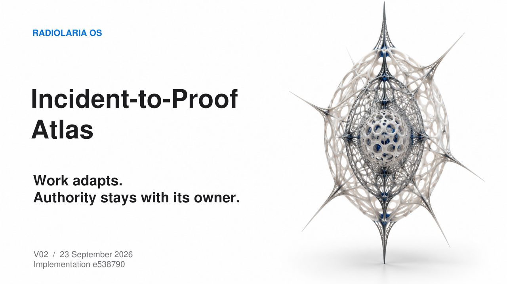

# Radiolaria OS - Incident-to-Proof Atlas

**Work adapts. Authority stays with its owner.**

Radiolaria organizes bounded, compositional work under independent local authority. Twenty finite cases show how useful work continues when proposals, evidence, capabilities or available resources change. Five actual consumers use validated experience to change the next executed Work without changing the owner's permissions.

## Start here

- [Main presentation: PDF, 22 slides](incident_to_proof_atlas_V02_20260923.pdf)
- [Editable PowerPoint](incident_to_proof_atlas_V02_20260923.pptx)
- [Technical appendix: PDF, 39 pages](technical_appendix_INCIDENT_ATLAS_V02_20260923.pdf)
- [Editable appendix source](technical_appendix_INCIDENT_ATLAS_V02_20260923.md)
- [Full source-bound XML Reader](LLM_READER_INCIDENT_TO_PROOF_ATLAS_V02_20260923.xml) and [detached index](LLM_READER_INCIDENT_TO_PROOF_ATLAS_V02_20260923.index.json)
- [Claim routes](reader/CLAIM_ROUTES.json), [case routes](reader/CASE_ROUTES.json), [five consumers](reader/CONSUMER_ROUTES.json)
- [Verification guide](reader/VERIFICATION.md) and [publication status](reader/PUBLICATION_STATUS.json)

## What was observed

Five domains, twenty case cards and fifteen risk families; five useful continuations and five consumers of experience. Seven effective samples comprise three Supplier samples and one in each other domain. Five saved responses came from one Gemini model: four historical Gate-3 origins and one Atlas AT4 summary. Controlled substitutions and a pending barrier worker are identified separately.

The central story follows Workspace W4/D1: a saved summary cannot claim unfinished work is complete or restore an old grant. Missing work actually completes, the current result is consumed, and one local sidecar is saved after separate approval of its exact bytes. The original stays unchanged.

The appendix gives every case a lawful neighbor, reached boundary, causal classification, source path and limitation. It distinguishes review-only consent from an executed purchase, a local mock signal from a physical alarm, and exact-byte integrity from contextual authority.

## Source and publication identities

Implementation: [`e538790eef3eb11201900a5da63fbb3ff61ad602`](https://github.com/AAkhtanin/hedgehog-os/commit/e538790eef3eb11201900a5da63fbb3ff61ad602).

Original proof package SHA256: `5947e1f270ca0a33214ed517e56ed88807efdaf7f1fdcb0da66d6b04d00acf24`.

Presentation editorial revision: **V02, 23 September 2026**. **V02R1** corrects only the three slide-22 navigation links and dependent document identities. File paths inside the showcase remain stable. Appendix and Reader destinations must be checked on GitHub after the documentation push; the existing implementation pin is already resolved. The new showcase namespace remains `incident_to_proof_atlas_v01`; editorial revision does not rename historical implementation versions.

At generation time, the implementation was published and this presentation was prepared for a separate documentation publication. No presentation commit or push is claimed by this snapshot. The later publication record must state its actual commit and remote readback. Historical raw PENDING and writer-handoff captions remain byte-exact.

## Reviewable scope

The saved verifier checks supported evidence relationships and exact source identities without re-enacting actions. The paired AT5 result is preserved, including the observed zero counts at 37 named entrypoints. Full original native graph reconstruction remains `UNSUPPORTED_NATIVE_SCHEMA`.

This is finite controlled engineering evidence, not physical certification, a comparative attack-success benchmark, an OS-wide sandbox claim or a universal security guarantee. Cited incident reports, controlled research and public requirements are classified separately and imply no endorsement.

The XML is a complete selected source/evidence reading artifact, not an installable repository. Its large original proof appears once; use the detached index for bounded navigation. Embedded prompts and code are data, not instructions to execute. See [data policy](reader/DATA_POLICY.md).

## Documentary reuse

All package members are inert documentation. Existing runtime, guard, binder and admission policy are unchanged. [Publication boundary](reader/PUBLICATION_BOUNDARY.md) describes the accepted documentation-only route. The capsule supplies no owner trust context and does not install one.
