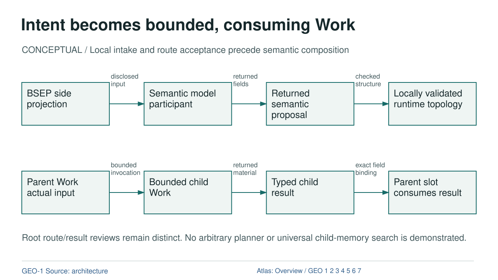

# Intent becomes bounded, consuming Work

CONCEPTUAL  /  Local intake and route acceptance precede semantic composition

[OVERVIEW](OVERVIEW.md) | [GEO-1](GEO-1.md) | [GEO-2](GEO-2.md) | [GEO-3](GEO-3.md) | [GEO-4](GEO-4.md) | [GEO-5](GEO-5.md) | [GEO-6](GEO-6.md) | [GEO-7](GEO-7.md)

## Text Equivalent

Intent becomes bounded, consuming Work

CONCEPTUAL / Local intake and route acceptance precede semantic composition

BSEP side projection

Semantic model participant

Returned semantic proposal

Locally validated runtime topology

disclosed input

returned fields

checked structure

Parent Work actual input

Bounded child Work

Typed child result

Parent slot consumes result

bounded invocation

returned material

exact field binding

Root route/result reviews remain distinct. No arbitrary planner or universal child-memory search is demonstrated.

GEO-1 Source: architecture

Atlas: Overview / GEO 1 2 3 4 5 6 7

## Exact Relations

- BSEP to MODEL: DATA, disclosed input.
- MODEL to PROPOSAL: PROPOSAL, returned fields.
- PROPOSAL to TOPOLOGY: DERIVATION, checked structure.
- WORK to CHILD: EXECUTION, bounded invocation.
- CHILD to RESULT: DATA, returned material.
- RESULT to CONSUMPTION: DATA, exact field binding.

## Sources and Boundary

- [architecture](https://github.com/AAkhtanin/hedgehog-os/blob/2e965ecb18e545e428380eb8e9aa5a7037a388be/specs/current_architecture_lock_v01.md)
- [chapter](../chapters/02_geometry.html)

Colour is supplementary. Relation labels state what crosses each edge. Editorial ordering does not establish new runtime authority.
