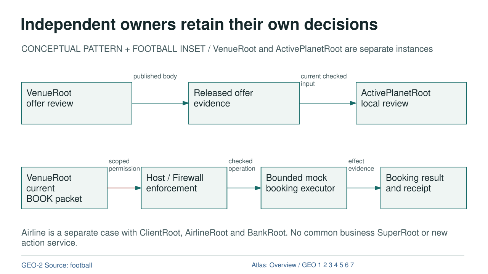

# Independent owners retain their own decisions

CONCEPTUAL PATTERN + FOOTBALL INSET  /  VenueRoot and ActivePlanetRoot are separate instances

[OVERVIEW](OVERVIEW.md) | [GEO-1](GEO-1.md) | [GEO-2](GEO-2.md) | [GEO-3](GEO-3.md) | [GEO-4](GEO-4.md) | [GEO-5](GEO-5.md) | [GEO-6](GEO-6.md) | [GEO-7](GEO-7.md)

## Text Equivalent

Independent owners retain their own decisions

CONCEPTUAL PATTERN + FOOTBALL INSET / VenueRoot and ActivePlanetRoot are separate instances

VenueRoot offer review

Released offer evidence

ActivePlanetRoot local review

published body

current checked input

VenueRoot current BOOK packet

Host / Firewall enforcement

Bounded mock booking executor

Booking result and receipt

scoped permission

checked operation

effect evidence

Airline is a separate case with ClientRoot, AirlineRoot and BankRoot. No common business SuperRoot or new action service.

GEO-2 Source: football

Atlas: Overview / GEO 1 2 3 4 5 6 7

## Exact Relations

- VENUE to B: DATA, published body.
- B to REQUESTER: DATA, current checked input.
- PACKET to FIREWALL: PERMISSION, scoped permission.
- FIREWALL to EXECUTOR: EXECUTION, checked operation.
- EXECUTOR to RECEIPT: DATA, effect evidence.

## Sources and Boundary

- [football](../references/episode_sources.json)
- [chapter](../chapters/07_football.html)

Colour is supplementary. Relation labels state what crosses each edge. Editorial ordering does not establish new runtime authority.
