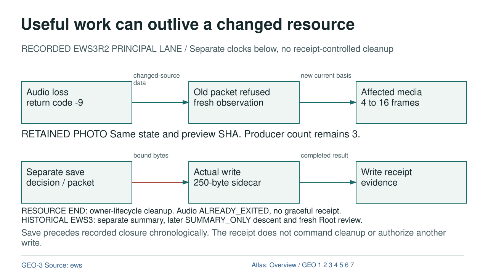

# Useful work can outlive a changed resource

RECORDED EWS3R2 PRINCIPAL LANE  /  Separate clocks below, no receipt-controlled cleanup

[OVERVIEW](OVERVIEW.md) | [GEO-1](GEO-1.md) | [GEO-2](GEO-2.md) | [GEO-3](GEO-3.md) | [GEO-4](GEO-4.md) | [GEO-5](GEO-5.md) | [GEO-6](GEO-6.md) | [GEO-7](GEO-7.md)

## Text Equivalent

Useful work can outlive a changed resource

RECORDED EWS3R2 PRINCIPAL LANE / Separate clocks below, no receipt-controlled cleanup

Audio loss return code -9

Old packet refused fresh observation

Affected media 4 to 16 frames

changed-source data

new current basis

RETAINED PHOTO Same state and preview SHA. Producer count remains 3.

Separate save decision / packet

Actual write 250-byte sidecar

Write receipt evidence

bound bytes

completed result

RESOURCE END: owner-lifecycle cleanup. Audio ALREADY_EXITED, no graceful receipt. HISTORICAL EWS3: separate summary, later SUMMARY_ONLY descent and fresh Root review.

Save precedes recorded closure chronologically. The receipt does not command cleanup or authorize another write.

GEO-3 Source: ews

Atlas: Overview / GEO 1 2 3 4 5 6 7

## Exact Relations

- ENV to CURRENTNESS: DATA, changed-source data.
- CURRENTNESS to WORK: DATA, new current basis.
- ROOT to EXECUTOR: PERMISSION, bound bytes.
- EXECUTOR to RECEIPT: DATA, completed result.

## Sources and Boundary

- [ews](../references/ews/source_ledger.json)
- [chapter](../chapters/09_workspace.html)

Colour is supplementary. Relation labels state what crosses each edge. Editorial ordering does not establish new runtime authority.
