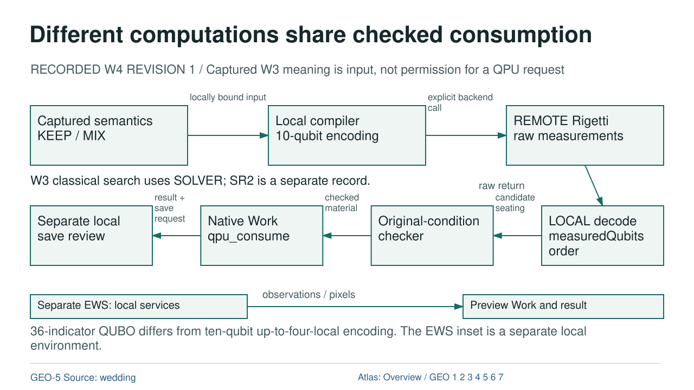

# Different computations share checked consumption

RECORDED W4 REVISION 1  /  Captured W3 meaning is input, not permission for a QPU request

[OVERVIEW](OVERVIEW.md) | [GEO-1](GEO-1.md) | [GEO-2](GEO-2.md) | [GEO-3](GEO-3.md) | [GEO-4](GEO-4.md) | [GEO-5](GEO-5.md) | [GEO-6](GEO-6.md) | [GEO-7](GEO-7.md)

## Text Equivalent

Different computations share checked consumption

RECORDED W4 REVISION 1 / Captured W3 meaning is input, not permission for a QPU request

Captured semantics KEEP / MIX

Local compiler 10-qubit encoding

REMOTE Rigetti raw measurements

locally bound input

explicit backend call

LOCAL decode measuredQubits order

Original-condition checker

Native Work qpu_consume

Separate local save review

candidate seating

checked material

result + save request

raw return

W3 classical search uses SOLVER; SR2 is a separate record.

Separate EWS: local services

Preview Work and result

observations / pixels

36-indicator QUBO differs from ten-qubit up-to-four-local encoding. The EWS inset is a separate local environment.

GEO-5 Source: wedding

Atlas: Overview / GEO 1 2 3 4 5 6 7

## Exact Relations

- PROPOSAL to COMPILER: DATA, locally bound input.
- COMPILER to QPU: EXECUTION, explicit backend call.
- DECODER to CHECKER: DATA, candidate seating.
- CHECKER to CONSUMPTION: DATA, checked material.
- CONSUMPTION to ROOT: DATA, result + save request.
- QPU to DECODER: DATA, raw return.
- ENV to WORK: DATA, observations / pixels.

## Sources and Boundary

- [wedding](../references/wedding/SOURCE_LEDGER.json)
- [chapter](../chapters/08_wedding.html)

Colour is supplementary. Relation labels state what crosses each edge. Editorial ordering does not establish new runtime authority.
