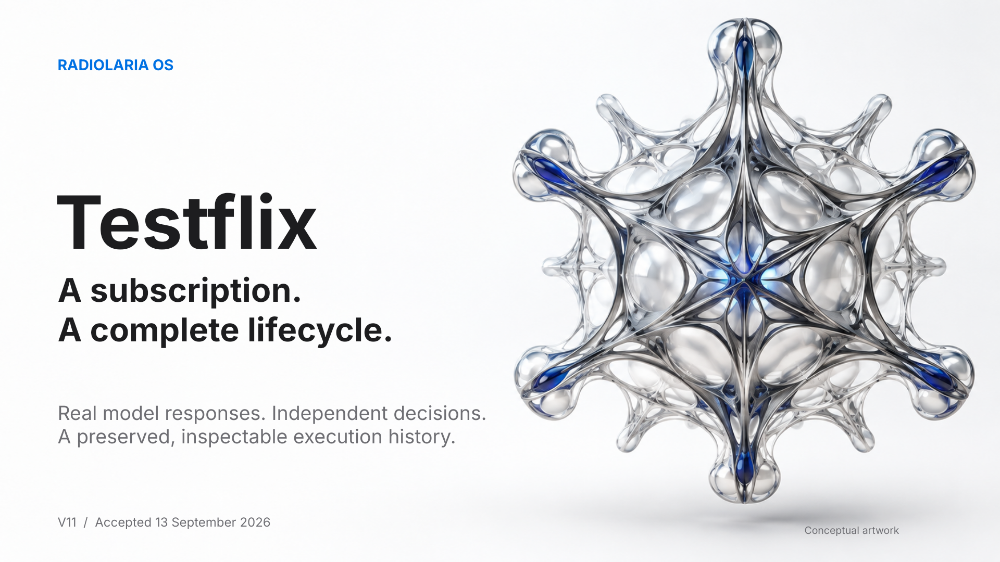

# Testflix V11 - Radiolaria OS



Real model reasoning, four independent Roots, and a complete mock subscription lifecycle: choice, payment, entitlement, playback, changing terms, expiry and explicit renewal.

**Accepted implementation:** [`e42d37f`](https://github.com/AAkhtanin/hedgehog-os/commit/e42d37fa98dfec7110b8cf75b1aceaa614f461be) · **13 September 2026**. This showcase presents the accepted finite Testflix scope. It adds no new runtime execution or acceptance claim.

## Start here

| File | What it gives you |
| --- | --- |
| [Presentation](testflix_showcase_v11.pdf) | The main visual narrative in PDF |
| [Editable deck](testflix_showcase_v11.pptx) | The same presentation in PowerPoint |
| [Executive one-pager](executive_one_pager_v11.pdf) | A concise overview for a first read |
| [Technical appendix](technical_appendix_v11.pdf) | Roles, authority, lifecycle, history, validation and provenance |
| [Offline story](story.html) | A responsive HTML narrative with links to the evidence |
| [One-file LLM reader](LLM_READER_TESTFLIX_V11.xml) | A structured account, selected original records and source code |
| [Claim-to-evidence matrix](claim_evidence_matrix_v11.json) | Machine-readable bindings from presentation claims to sources |
| [Evidence map](evidence/evidence_map.json) | Archive identities, exact member hashes and copied-record paths |
| [Evidence directory](evidence/) | Selected original records and labelled extracts |
| [Checksums](SHA256SUMS) | SHA-256 identities of the published package files |

GitHub renders the PDFs and this README. To see the HTML as a page, open `story.html` from a local copy of this folder, keeping its `assets/` and `evidence/` directories alongside it. No web server or model call is required.

## What happened

The initial `AD_FREE` request has an EUR 6.50 ceiling and selects an EUR 5.00, 720p, ad-free plan. Four distinct semantic roles supply validated reasoning. UserRoot, BankRoot, ProviderRoot and DeviceRoot independently govern the mock purchase and playback path.

The same four Hosts then retain the main story through informational reuse, stop and fresh-session actions, expiry and explicit renewal. That story ends with exactly **two mock payments**. A separate controlled P04 execution exercises actual public E recomputation: EUR 7.00 is above the old EUR 6.50 consent, while an independent EUR 6.00 control passes. Previously paid history is preserved.

The completed A/B changes the preference to `QUALITY` while keeping the catalogue and ceiling. With the clarified ranking rule, it selects the eligible EUR 6.00, 1080p plan with ads. Real responses **14, 15, 19 and 20** are consumed; only **19 and 20** were new model calls in V10. Its independent mock payment does not change the main story's count of two.

Captured A/B reexecutes the saved inputs on fresh Hosts with zero LLM calls. Its history differs from the live result only at two explicitly identified mode fields. Historical replay is a separate evidence-reading operation with no provider or capability calls.

## Read the timing correctly

| Recorded operation | Time | Scope |
| --- | ---: | --- |
| Initial purchase handle | 169.096 s | P01 handle, before the separate 8.744 s seal |
| Main purchase-to-renewal story | 1,174.797 s / 19.6 min | Includes multiple stop/start actions, final sealing and replay; P04 is separate |
| Live QUALITY A/B | 290.806 s | Wall time for the completed A/B command |
| Captured QUALITY A/B | 276.216 s | Fresh Hosts, zero model calls |
| P04 public E at EUR 7.00 / EUR 6.00 | 317.991 / 318.910 s | Two separate recorded controlled branches |

These are recorded measurements, not a general latency SLA. The approximately five-minute A/B figure does not describe the full main lifecycle.

## Historical truth and current acceptance

- [Preserved V09 history](https://github.com/AAkhtanin/hedgehog-os/tree/268f22a7940068fd58e00e6f96dc2d13a7d71890/docs/showcase/history/testflix_v09_20260912): the first successful main story, an actual model disagreement, two Google 504 errors and a ReadTimeout. A/B was incomplete at that point.
- V10: completed the missing A/B responses and captured comparison, preserving earlier attempts.
- V11: repaired canonical saved-projection validation and owner-process recovery, then prepared admission.
- Owner execution: committed and pushed the accepted implementation. **49 tests / 147 phases** passed after commit. V11 preparation's **82 tests / 246 phases** and **eight process controls** are separate evidence sets, not an additive total.

The cumulative attempt ledger contains **20 attempts, 17 responses and three transport failures**. An obtained response is not automatically a successful transaction. The main execution consumed eight responses; the historical refused A/B remains preserved.

## Sources and reproducibility

The [evidence map](evidence/evidence_map.json) names the exact V09, V10, V11 and owner-execution archive hashes. Each copied source record carries its original archive member identity. Large histories are represented by hash-bound archive references; selected extracts are explicitly marked as derived.

The XML reader embeds selected source bodies as readable text, including the full model response/failure ledger and selected accepted code. It is deliberately smaller than the original archives and cannot replace every large runtime artifact for a full independent reconstruction.

Accepted source entry points:

- [Testflix domain code](https://github.com/AAkhtanin/hedgehog-os/tree/e42d37fa98dfec7110b8cf75b1aceaa614f461be/hedgehog/domains/testflix)
- [Semantic duties](https://github.com/AAkhtanin/hedgehog-os/blob/e42d37fa98dfec7110b8cf75b1aceaa614f461be/hedgehog/domains/testflix/semantic_roles_v01.py)
- [Live/captured adapter](https://github.com/AAkhtanin/hedgehog-os/blob/e42d37fa98dfec7110b8cf75b1aceaa614f461be/hedgehog/domains/testflix/live_semantic_adapter_v01.py)
- [Domain contracts](https://github.com/AAkhtanin/hedgehog-os/blob/e42d37fa98dfec7110b8cf75b1aceaa614f461be/hedgehog/domains/testflix/contracts_v01.py)
- [Shared execution Host](https://github.com/AAkhtanin/hedgehog-os/blob/e42d37fa98dfec7110b8cf75b1aceaa614f461be/hedgehog/work_execution_host_v01.py)

From this directory, verify the downloaded files:

```sh
shasum -a 256 -c SHA256SUMS
```

On GNU systems, use `sha256sum -c SHA256SUMS`. Opening these presentation files or verifying their hashes does not invoke the project runtime, a model or a business adapter.

## Scope

Gemini transport, consumed semantic outputs, public kernel/Host execution, Root reviews and captured reexecution are real. The catalogue, time source, bank, provider and device effects are controlled. This is not a real Netflix purchase, bank transaction, physical television action, external time attestation, arbitrary-domain certification or production certification. Renewal requires explicit consent. A new informational summary during the renewed period remains outside accepted scope.

The hero image is a conceptual illustration, not a runtime topology. The light visual language takes inspiration from [Apple Events](https://www.apple.com/apple-events/) and [Inter](https://rsms.me/inter/); this is an independent project with no Apple or Netflix affiliation.
